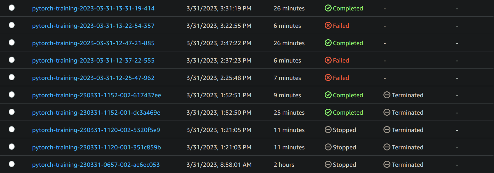
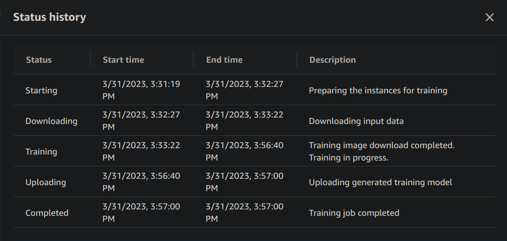
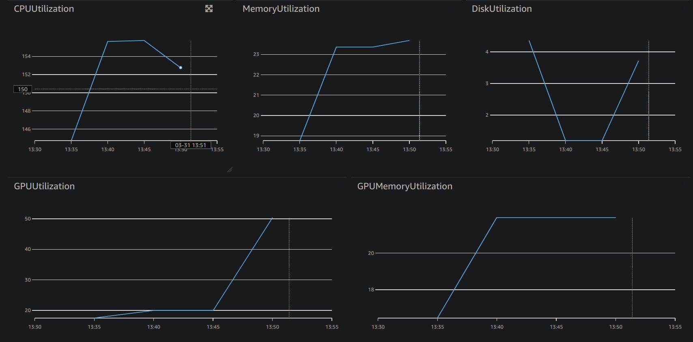

<!-- # Image Classification using AWS SageMaker -->
# Dog breed Classification using AWS SageMaker

<!-- Use AWS Sagemaker to train a pretrained model that can perform image classification by using the Sagemaker profiling, debugger, hyperparameter tuning and other good ML engineering practices. This can be done on either the provided dog breed classication data set or one of your choice. -->
Use AWS Sagemaker to train a pretrained ResNet50 model that can perform dogbreed
classification by using the Sagemaker profiling, debugger, hyperparameter tuning.

## Project Set Up and Installation
<!-- Enter AWS through the gateway in the course and open SageMaker Studio. 
Download the starter files.
Download/Make the dataset available.  -->
1. Enter AWS and open SageMaker Studio.
1. Clone [this repo](https://github.com/HossamKhir/CD0387-deep-learning-topics-within-computer-vision-nlp-project-starter.git).
1. Open the [notebook](./train_and_deploy.ipynb), select the image of
   `PyTorch 1.13.1 CPU`, with any instance type.
1. Review the `instance_type_*` variables, to confirm or choose your own.
1. Run the notebook.

## Dataset
<!-- The provided dataset is the dogbreed classification dataset which can be found in the classroom.
The project is designed to be dataset independent so if there is a dataset that is more interesting or relevant to your work, you are welcome to use it to complete the project. -->
The provided dataset is the
[dogbreed classification dataset](https://s3-us-west-1.amazonaws.com/udacity-aind/dog-project/dogImages.zip)
The project is designed to be dataset independent so if there is a dataset that
is more interesting or relevant to your work, you are welcome to use it.

### Access
<!-- Upload the data to an S3 bucket through the AWS Gateway so that SageMaker has access to the data.  -->
The notebook uploads the data to an S3 bucket through the AWS Gateway so that
SageMaker has access to the data.

## Hyperparameter Tuning
<!-- What kind of model did you choose for this experiment and why? Give an overview of the types of parameters and their ranges used for the hyperparameter search

Remember that your README should:
- Include a screenshot of completed training jobs
- Logs metrics during the training process
- Tune at least two hyperparameters
- Retrieve the best best hyperparameters from all your training jobs -->
The [ResNet50](https://pytorch.org/vision/main/models/generated/torchvision.models.resnet50.html)
model was selected for fine tuning, it is a powerful model, and of an
appropriate parameter size.

|  |  |  |
|:----------------------------------|:---------------------------------:|----------------------------------:|

## Debugging and Profiling
<!-- **TODO**: Give an overview of how you performed model debugging and profiling in Sagemaker -->
Following instructions from the lessons:

1. Setup the training code with hooks for debugging & profiling.
1. Define modes within training & evaluation functions.
1. Installed and imported all necessary modules (`sagemaker`, & `smdebug`)
1. Defined rules for debugging & profiling
1. Instantiated both a debugger config & profiling config objects
1. Instantiated the estimator w/ best hyperparameters, and attached the config
   objects
1. The estimator was fit, and the output was saved to the default S3 bucket

### Results
<!-- **TODO**: What are the results/insights did you get by profiling/debugging your model?

**TODO** Remember to provide the profiler html/pdf file in your submission. -->
Feel free to the check the [report](profiler-report.html).

## Model Deployment

<!-- **TODO**: Give an overview of the deployed model and instructions on how to query the endpoint with a sample input.

**TODO** Remember to provide a screenshot of the deployed active endpoint in Sagemaker. -->
The final deployed model is a ResNet50, but with an alternate fully connected
layer, that goes has the layers:

1. Linear(in=$2048$, out=$512$) + ReLU
2. Dropout($50\%$)
3. Linear($512$, $133$) + LogSoftMax

To query the model, you need to load an image using `PIL`, and apply the
following transform:

- Resize ($224$, $224$)
- ToTensor
- Normalise ($0.5$, $0.5$, $0.5$)

Then call the `predictor.predict` method on the transformed image.

<!-- ## Standout Suggestions

**TODO (Optional):** This is where you can provide information about any standout suggestions that you have attempted. -->
